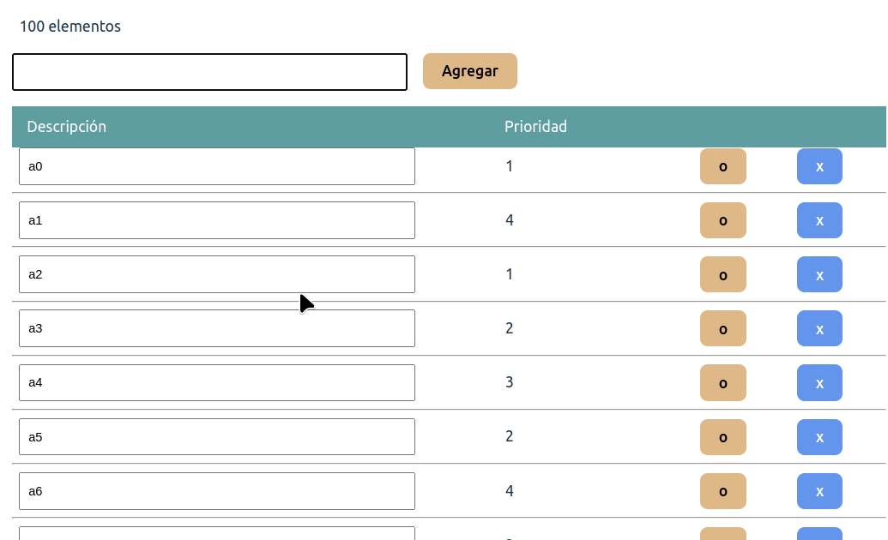
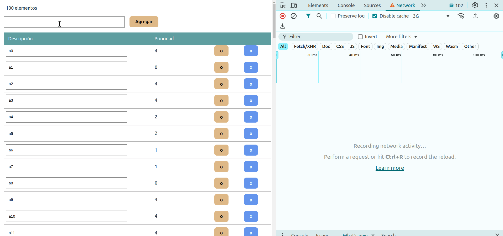
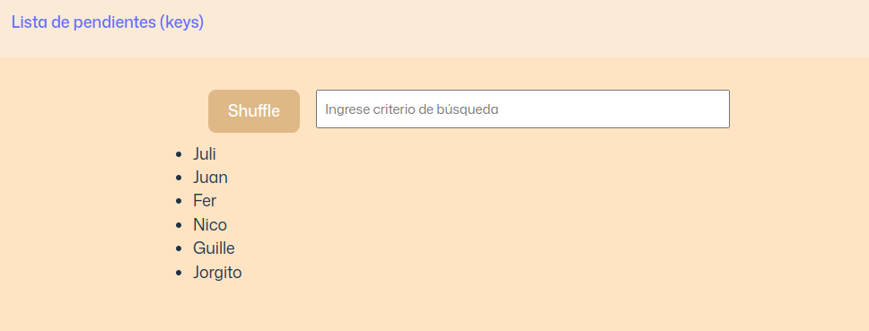
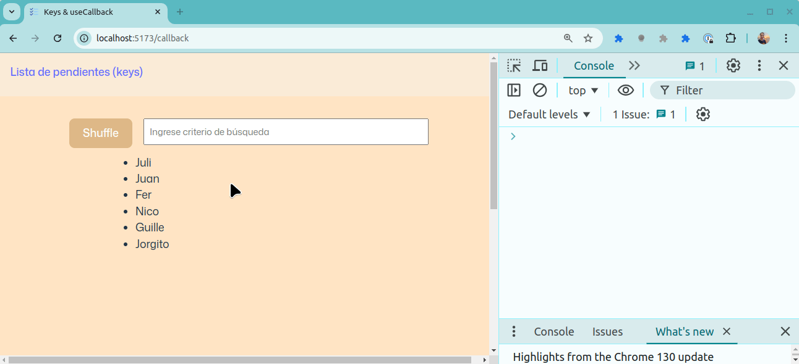
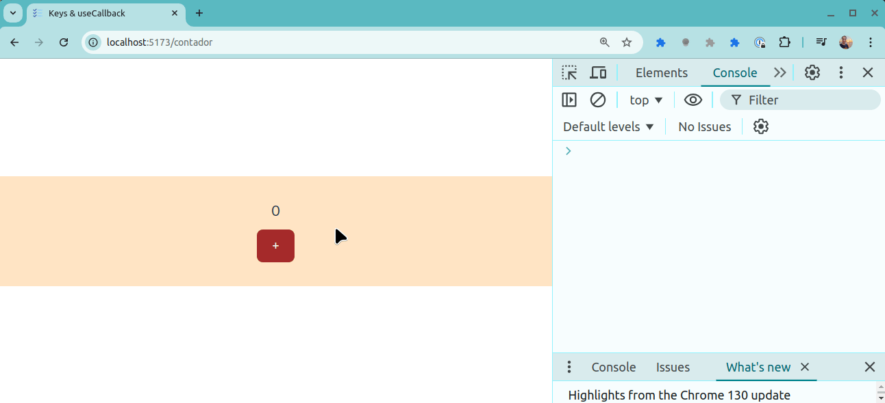
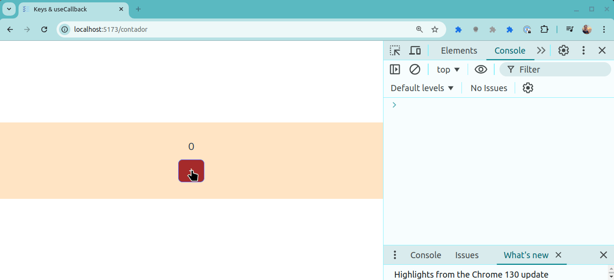

# Performance en React

## TODO List

Este ejemplo permite mostrar

- que es importante definir una key inmutable cuando trabajamos con un conjunto de componentes desarrollados por nosotros
- que hay que tener cuidado cuando hay operaciones que tardan (sobre todo si fuerzan un re-render, como el hook `useEffect`)
- en qué contexto podemos utilizar los hooks `useMemo` o `useCallback`

Para eso tenemos una lista de cosas pendientes o TODO list, donde

- podemos agregar un elemento
- o podemos editar la lista de tareas pendientes
- también podemos seleccionar varias tareas pendientes, lo que provoca que se visualice de manera diferente dicha lista

## Keys

Las variantes que tenemos son:

- que todos los componentes tengan como clave la constante 1
- utilizar un índice de los elementos
- aprovechar que cada tarea pendiente tiene un identificador único y utilizarlo como key

Con las dos primeras variantes vemos que React conserva el estado en base al índice. Como consecuencia, si nosotros seleccionamos los elementos que están en la posición 2 y la 4 respectivamente, y eliminamos un elemento, el estado seleccionado pasa a los elementos que originalmente estaban en las posiciones 3 y 5, pero que ahora al tener un elemento menos son los que pasan a estar en las posiciones 2 y 4:



Esta confusión se resuelve cuando utilizamos la variante que utiliza el id de la tarea como key.

## Performance

Como hemos visto anteriormente, no hay una razón de peso para trabajar con el hook `useEffect` a excepción de cuando queremos obtener información en el momento en el que inicializamos nuestra página.

A veces, sin embargo, nos puede parecer una buena idea aprovechar el `useEffect` para asociarlo a un cambio de estado e ir a buscar información a nuestra fuente de verdad (_source of truth_), operación que suele ser asincrónica porque se sale de la VM donde está la UI.

Vamos a proponer un cambio didáctico, donde queremos mostrar la cantidad de elementos al comienzo de la lista. Lo razonable sería aprovechar el estado `todoList` y escribir algo como

```tsx
  return <div className="page">
      <span>{todoList.length} elementos</span>
```

Sin embargo, una persona no tan experimentada podría querer definir otro state, algo como:

```ts
  const [length, setLength] = useState(0)
```

y luego mediante un useEffect calcular el valor cuando se actualice la lista:

```ts
  useEffect(() => {
    setLength(todoList.length)
  }, [todoList])
```

Por supuesto que no tiene sentido definir un estado si es calculable, pero el ejemplo es didáctico y además hay 3 lugares donde actualizamos la lista: al agregar un elemento, al modificarlo o al eliminarlo (podríamos unificar todo en una función común que genere el nuevo estado y actualizar allí la longitud, pero queremos ir por el otro camino para mostrar lo que puede pasar con la performance).

Ahora bien, ¿qué pasa si la operación del hook useEffect tarda? Empezamos a notar lentitud para trabajar en nuestra app, porque cada vez que escribimos en algún input se está renderizando toda la lista nuevamente:

```ts
  useEffect(() => {
    let i = 0
    while (i < 2000000000) i++
    setLength(todoList.length)
  }, [todoList])
```

Ok podrán decir, ésto ocurre porque estás bloqueando el event loop de la UI. Duro pero justo, cambiemos a esta otra variante, donde vamos a buscar un artículo en Medium y al terminar actualizamos el state `length`:

```ts
  useEffect(() => {
    fetch('https://medium.com/@cybersphere/fetch-api-the-ultimate-guide-to-cors-and-no-cors-cbcef88d371e', {
      mode: 'no-cors' 
    }).then(() => {
      setLength(todoList.length)
    })
  }, [todoList])
```

Como resultado pasan varias cosas:

- lo obvio es que la cantidad de elementos tarda en reflejarse. Esto es esperable, y si la operación de fetch trae información que produce un efecto y por ende un nuevo render del componente, tendré que ver la forma de comunicarlo al usuario: una animación, un pequeño spinner en el div que muestra la cantidad, etc.
- lo segundo es que se disparan varias llamadas de fetch. Esto no está bueno, posiblemente nos esté faltando una función que demore la llamada y haga [_debounce_](https://www.freecodecamp.org/news/javascript-debounce-example/). Te dejamos el artículo para que lo investigues.



## Docentes: useCallback

En el segundo ejemplo tenemos una página con la siguiente distribución:

- un botón Shuffle para cambiar el orden de los elementos
- un input que permite hacer una búsqueda
- y la lista de docentes de la materia



Un detalle interesante es que el input de búsqueda está en un componente aparte, porque queremos reutilizarlo en otro lugar:

```tsx
const Search = memo(({ onChange}: SearchPayload) => {
  console.info('Search renderizado')

  return (
    <input
      type='text'
      placeholder='Ingrese criterio de búsqueda'
      onChange={(event) => onChange(event.target.value)} />
  )
})
```

La función `memo` wrappea la definición de nuestro componente Search de manera de **memorizarlo** o **cachearlo** y aprovechar esa función hasta que cambie el parámetro `onChange` que se recibe como props.

No obstante cuando disparamos el reordenamiento (o shuffle) de los elementos, vemos que se vuelve a renderizar el componente de búsqueda también:



Lo mismo ocurre cuando queremos filtrar los docentes ingresando un valor. Esto ocurre porque al definir nuestra función handleSearch, lo hacemos **dentro del render de nuestro componente principal**:

```ts
export const DemoCallback = () => {
  ...

  // se crea una nueva función por cada render
  const handleSearch = (nombre: string) => {
    const docentesFiltrados = allDocentes.filter((docente: string) => docente.includes(nombre))
    setDocentes(docentesFiltrados)
  }

}
```

## ¿Es grave?

Lo primero que queremos decir es que eso no ocasiona ningún problema de performance. Pero si nuestro componente `Search` ejecutara acciones en background, o tuviera algún cálculo intensivo, empezarías a notar esa degradación por estar renderizando innecesariamente cada vez que hay un cambio de estado en el componente padre.

Para no crear una función cada vez, vamos a utilizar el hook `useCallback` que permite guardar la definición de la función hasta que alguna de ciertas dependencias cambie (la lista la podemos configurar nosotros como segundo parámetro):

```ts
  const handleSearch = useCallback((nombre: string) => {
    const docentesFiltrados = allDocentes.filter((docente: string) => docente.includes(nombre))
    setDocentes(docentesFiltrados)
  }, [])
```

Como el filtro de la lista solo depende del valor que ingresamos, y está desacoplado del estado de mi componente raíz (porque lo pasamos como parámetro), el resultado es que solo necesitamos crear la función `handleSearch` una vez, y a partir de allí reutilizamos esa definición siempre:

```ts
  const handleSearch = useCallback((nombre: string) => {
    const docentesFiltrados = allDocentes.filter((docente: string) => docente.includes(nombre))
    setDocentes(docentesFiltrados)
  }, [])
```


## ¿Entonces es recomendable utilizar useCallback siempre?

No, por lo general **es una mala idea**. `useCallback` cachea la definición de la función. Veamos en la ruta `/contador` este ejemplo donde tenemos

- un componente padre que define el estado del contador y una función que lo incrementa, y se lo pasa...
- a un componente hijo

```tsx
const Contador = ({ contador, incrementar}: ContadorPayload) => {
  useEffect(() => {
    console.info('tengo una nueva función increment')
  }, [incrementar])

  return <div className='main'>
    <span className='contador'>{contador}</span>
    <button className='primary' onClick={incrementar}>+</button>
  </div>
}

export const AppContador = () => {
  const [counter, setCounter] = useState(0)
  const increment = () => { setCounter(counter + 1) }
  return (
    <Contador contador={counter} incrementar={increment} />
  )
}
```

Lo primero que ocurre es esperable: cuando hago click en el botón, eso llama a la función del componente padre que cambia el estado, genera una nueva función `increment`. El `useEffect` puesto en el hijo nos avisa que recibió una función nueva:


El riesgo está en que al recibir una nueva función eso estuviera asociado a

- operaciones costosas 
- o que disparara acciones en background (como pegarle a un backend)

lo que podría degradar la performance.

La primera versión de useCallback podría ser:

```ts
  const increment = useCallback(() => {
    setCounter(counter + 1)
  }, [counter])
```

lo cual **no tiene ningún efecto**. Cada vez que llamamos a increment eso actualiza el estado del contador, y como el `useCallback` tiene como dependencia `counter`, **se genera una nueva función igual que antes**.

Ok, podríamos pensar entonces en sacar esa dependencia:

```ts
  const increment = useCallback(() => {
    setCounter(counter + 1)
  }, [])
```

Lejos de arreglar el problema, introducimos uno nuevo: ahora la función solo incrementa el contador la primera vez:



Vemos no obstante que no se dispara un `console.info` lo que marca que no estamos generando nuevas funciones, pero la función `increment` está atada al valor del contador en el momento de crearse la primera vez (`counter` es 0). La solución es utilizar `setCounter` tomando el valor previo:

```ts
  const increment = useCallback(() => {
    setCounter(prevCounter => prevCounter + 1)
  }, [])
```

Ahora sí, no generamos nuevas instancias de la función `increment` y el contador funciona correctamente:



## La conclusión

> No es una buena práctica utilizar `useCallback` hasta tanto no nos encontremos con un problema de performance: el código que se genera es menos legible, tenemos que ser precavidos para no generar funciones todo el tiempo y peor aún, puede ser que al cachear la función el estado no se vea reflejado y el usuario tenga una mala experiencia de usuario.

## Material adicional

- [useCallback](https://www.youtube.com/watch?v=duh3uKn0qnU)
- [Use Memo](https://www.youtube.com/watch?v=THL1OPn72vo)
- [Mastering Memo](https://www.youtube.com/watch?v=DEPwA3mv_R8)
