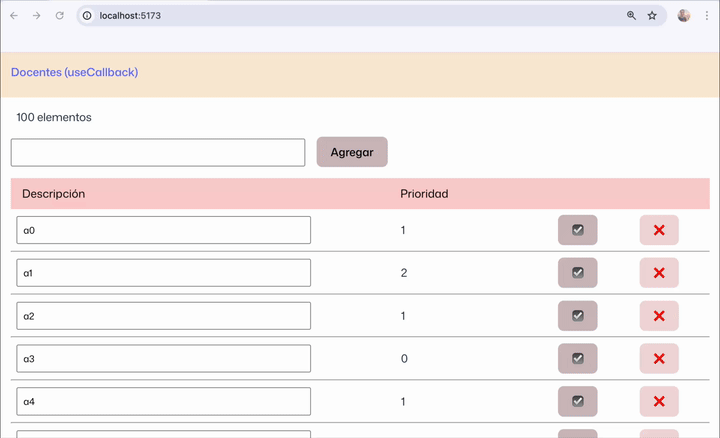
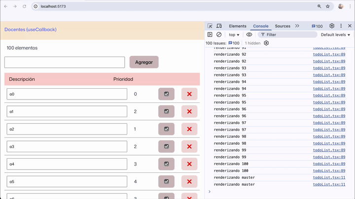
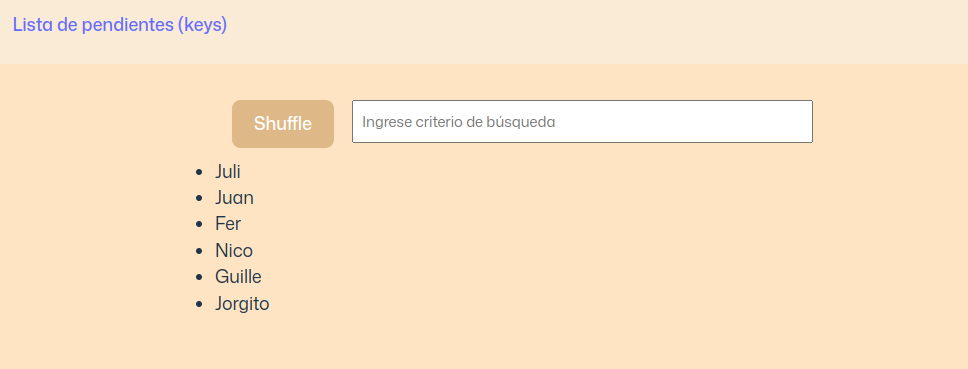
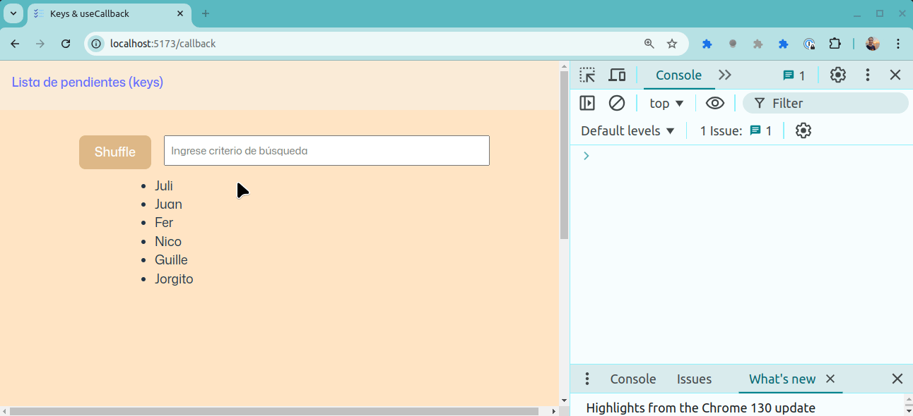
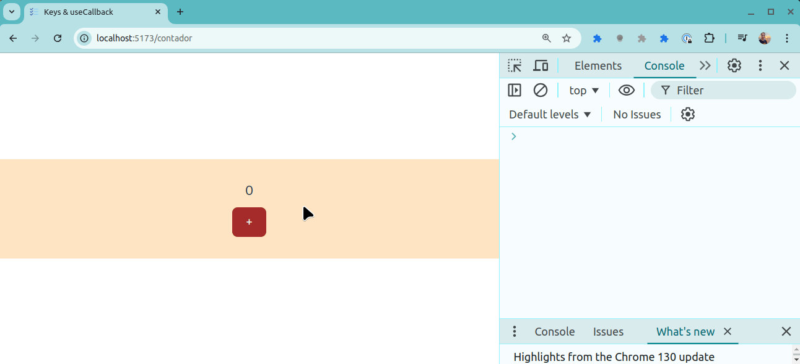
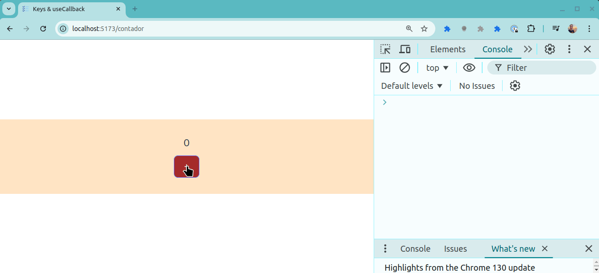

# Performance en React

[](https://github.com/uqbar-project/eg-performance-react/actions/workflows/build.yml)

## TODO List

Este ejemplo permite mostrar

- que es importante definir una key inmutable cuando trabajamos con un conjunto de componentes desarrollados por nosotros
- que hay que tener cuidado cuando hay operaciones que tardan (sobre todo si fuerzan un re-render, como el hook `useEffect`)
- en qué contexto podemos utilizar los hooks `useMemo` o `useCallback`

Para eso tenemos una lista de cosas pendientes o TODO list, donde

- podemos agregar un elemento
- o podemos editar la lista de tareas pendientes
- también podemos seleccionar varias tareas pendientes, lo que provoca que se visualice de manera diferente dicho elemento en la lista

## Mapa de ejemplos

| Ruta | Título | Concepto | Solución manual (líneas `MANUAL` en el código) |
|---|---|---|---|
| `/` | TodoList - keys y useEffect | keys estables, estado derivado, efecto bloqueante | — (el ejemplo *es* el anti-patrón) |
| `/docentes` | Docentes - memo | `memo` + referencia estable | `memo` + `useCallback` |
| `/contador` | Contador - useCallback | closures desactualizados, `useCallback` con dependencias | `useCallback` con forma funcional de `setState` |
| `/lista` | Lista pesada - useMemo | cómputo costoso, `useMemo`, `useDeferredValue`, fetch con cleanup | `useMemo` |
| `/props` | Props inestables - memo | props inline que rompen `memo` | `useMemo` + `useCallback` |

Todos los ejemplos están escritos sin los hooks de memoización a propósito (salvo que se activen las líneas `MANUAL` en clase), y cada página muestra si el bundle actual corre con el Compiler ON u OFF. Para cambiar de modo:

```bash
pnpm dev              # con Compiler
pnpm dev:sin-compiler # sin Compiler
```

## Keys

Arriba de la lista hay un selector para elegir la key de cada fila:

- `id (estable)`: cada tarea usa su identificador único
- `índice`: se usa la posición en la lista
- `constante 1`: todas las filas comparten la misma key

Con las dos últimas variantes vemos que React conserva la referencia por cosas que no se mantienen fijas para el mismo elemento. Como consecuencia, si nosotros seleccionamos los elementos que están en la posición 2 y la 4 respectivamente, y eliminamos un elemento, el estado seleccionado pasa a los elementos que originalmente estaban en las posiciones 3 y 5, pero que ahora al tener un elemento menos son los que pasan a estar en las posiciones 2 y 4:



Esta confusión se resuelve cuando utilizamos la variante que utiliza el id de la tarea como key.

## Performance

Como hemos visto anteriormente, no hay una razón de peso para trabajar con el hook `useEffect` a excepción de cuando queremos obtener información en el momento en el que inicializamos nuestra página.

A veces, sin embargo, nos puede parecer una buena idea aprovechar el `useEffect` para asociarlo a un cambio de estado e ir a buscar información a nuestra fuente de verdad (_source of truth_), operación que suele ser asincrónica porque se sale de la VM donde está la UI.

Vamos a proponer un cambio didáctico, donde queremos mostrar la cantidad de elementos al comienzo de la lista. Lo razonable sería aprovechar el estado `todoList` y escribir algo como

```tsx
  return <div className="page">
      <span>{todoList.length} elementos</span>
```

Sin embargo, una persona no tan experimentada podría querer definir otro state, algo como:

```ts
  const [length, setLength] = useState(0)
```

y luego mediante un useEffect calcular el valor cuando se actualice la lista:

```ts
  useEffect(() => {
    setLength(todoList.length)
  }, [todoList])
```

Por supuesto que no tiene sentido definir un estado si es calculable, pero el ejemplo es didáctico y además hay 3 lugares donde actualizamos la lista: al agregar un elemento, al modificarlo o al eliminarlo (podríamos unificar todo en una función común que genere el nuevo estado y actualizar allí la longitud, pero queremos ir por el otro camino para mostrar lo que puede pasar con la performance).

Ahora bien, ¿qué pasa si la operación del hook useEffect tarda? Hay un checkbox "Simular cálculo pesado en useEffect" (activado por defecto) que ejecuta ese bloqueo. Empezamos a notar lentitud para trabajar en nuestra app, porque cada vez que escribimos en algún input se está renderizando toda la lista nuevamente:

```ts
  useEffect(() => {
    let i = 0
    while (i < 2000000000) i++
    setLength(todoList.length)
  }, [todoList])
```

Ok podrán decir, ésto ocurre porque estás bloqueando el event loop de la UI. Duro pero justo, cambiemos a esta otra variante, donde vamos a buscar un artículo en Medium y al terminar actualizamos el state `length`:

```ts
  useEffect(() => {
    fetch('https://httpbin.org/delay/5')
      .then(response => response.json())
      .then(_data => {
        setLength(todoList.length)
      })
  }, [todoList])
```

Como resultado la cantidad de elementos tarda en reflejarse. Esto es esperable, y si la operación de fetch trae información que produce un efecto y por ende un nuevo render del componente, tendré que ver la forma de comunicarlo al usuario: una animación, un pequeño spinner en el div que muestra la cantidad, etc.



> Detalle: al editar o eliminar una tarea, la lista se actualiza de forma inmutable (se crea una lista nueva con `map`/`filter`, sin modificar el objeto original). Mutar el estado directamente (`todoItem.description = ...`) rompe la forma en que React —y en particular el React Compiler— detecta los cambios, así que evitamos ese patrón.

## Docentes - memo

La página tiene la siguiente distribución:

- un botón Shuffle para cambiar el orden de los elementos
- un input que permite hacer una búsqueda
- y la lista de docentes de la materia



Un detalle interesante es que el input de búsqueda está en un componente aparte, porque queremos reutilizarlo en otro lugar. Y a propósito está escrito **sin** `memo` ni `useCallback`. La solución manual está lista en el código en líneas marcadas `MANUAL`, para descomentar en clase:

```tsx
const SearchBase = ({ onChange }: SearchPayload) => {
  console.info('Search renderizado')
  // ...
}

const Search = SearchBase
// MANUAL: const Search = memo(SearchBase)
```

```ts
export const Docentes = () => {
  // ...
  const handleSearchBase = (nombre: string) => {
    const docentesFiltrados = allDocentes.filter((docente: string) => docente.includes(nombre))
    setDocentes(docentesFiltrados)
  }

  const handleSearch = handleSearchBase
  // MANUAL: const handleSearch = useCallback(handleSearchBase, [])
}
```

### ¿Por qué `onChange` debe cachearse? ¿El `memo` es necesario?

`memo` y `useCallback` son un par inseparable, cada uno cumple un rol distinto:

- `memo` envuelve al hijo y compara sus props con `===`. Si son iguales, saltea el re-render.
- `useCallback` le da al padre una referencia **estable** de `handleSearch` entre renders, para que esa comparación pueda dar igual.

Uno sin el otro no funciona:

- `memo` sin `useCallback`: `onChange` es una función nueva en cada render, la comparación siempre da distinto y el hijo se re-renderiza igual (probalo: desactiva solo la línea MANUAL del `useCallback` y mirá la consola en modo sin-compiler).
- `useCallback` sin `memo`: nada compara las props, así que el hijo se re-renderiza cada vez que el padre lo hace, aunque la referencia sea estable.

¿Y con el Compiler? Ambos sobran: él estabiliza la referencia y decide cuándo saltear el re-render sin que escribas ninguno de los dos.

Como el filtro solo depende del valor ingresado (desacoplado del estado del componente raíz porque lo pasamos como parámetro), alcanza con crear `handleSearch` una vez y reutilizarla siempre:



La página muestra dos badges: la cantidad de renders del padre y si el Compiler está ON u OFF en este bundle.

**Cómo probarlo en clase:**

1. Con `pnpm dev` (Compiler ON), abrir la consola y presionar Shuffle varias veces: el badge del padre aumenta pero `Search` no se re-renderiza.
2. Con `pnpm dev:sin-compiler` (Compiler OFF) repetir: ahora `Search` sí se re-renderiza en cada Shuffle (el problema original).
3. Ejercicio (en modo sin-compiler): activá las dos líneas MANUAL (`memo` + `useCallback`) y verificá que el re-render desaparece. Probá activar solo una de las dos para ver por qué el par es inseparable. Volvé a modo con-compiler: sigue sin re-renderizar, pero ahora los hooks manuales son redundantes.

## ¿Es grave que Search se re-renderice de más?

Lo primero que queremos decir es que eso no ocasiona ningún problema de performance. Pero si nuestro componente `Search` ejecutara acciones en background, o tuviera algún cálculo intensivo, empezarías a notar esa degradación por estar renderizando innecesariamente cada vez que hay un cambio de estado en el componente padre.

## ¿Entonces es recomendable utilizar useCallback siempre?

No, por lo general **es una mala idea**. `useCallback` cachea la definición de la función. Veamos en la ruta `/contador` este ejemplo, donde el padre define el contador con una función común (sin `useCallback`) y se la pasa al hijo:

```tsx
export const AppContador = () => {
  const [counter, setCounter] = useState(0)
  const increment = () => { setCounter((prevCounter) => prevCounter + 1) }
  return (
    <Contador contador={counter} incrementar={increment} />
  )
}
```

El hijo tiene un `useEffect` que avisa cada vez que recibe una función nueva. Con `pnpm dev` (Compiler ON) ese aviso no aparece al incrementar: la referencia se estabiliza sola. Con `pnpm dev:sin-compiler` el aviso reaparece en cada click (el problema original).

Ejercicio: en modo sin-compiler, envolvé `increment` con `useCallback` a mano. Pero cuidado con las dos trampas clásicas que muestra este ejemplo:

Lo primero que ocurre es esperable: cuando hago click en el botón, eso llama a la función del componente padre que cambia el estado, genera una nueva función `increment`. El `useEffect` puesto en el hijo nos avisa que recibió una función nueva:


El riesgo está en que al recibir una nueva función eso estuviera asociado a

- operaciones costosas 
- o que disparara acciones en background (como pegarle a un backend)

lo que podría degradar la performance.

La primera versión de useCallback podría ser:

```ts
  const increment = useCallback(() => {
    setCounter(counter + 1)
  }, [counter])
```

lo cual **no tiene ningún efecto**. Cada vez que llamamos a increment eso actualiza el estado del contador, y como el `useCallback` tiene como dependencia `counter`, **se genera una nueva función igual que antes**.

Ok, podríamos pensar entonces en sacar esa dependencia:

```ts
  const increment = useCallback(() => {
    setCounter(counter + 1)
  }, [])
```

Lejos de arreglar el problema, generamos uno nuevo: ahora la función solo incrementa el contador la primera vez:



Vemos no obstante que no se dispara un `console.info` lo que marca que no estamos generando nuevas funciones, pero la función `increment` está atada al valor del contador en el momento de crearse la primera vez (`counter` es 0). La solución es utilizar `setCounter` tomando el valor previo:

```ts
  const increment = useCallback(() => {
    setCounter(prevCounter => prevCounter + 1)
  }, [])
```

Ahora sí, no generamos nuevas instancias de la función `increment` y el contador funciona correctamente:



Notar que en el código actual del ejemplo igual se usa la forma funcional `setCounter(prev => ...)` para no leer un valor desactualizado del contador, con o sin Compiler.

## La conclusión

> No es una buena práctica utilizar `useCallback` hasta tanto no nos encontremos con un problema de performance: el código que se genera es menos legible, tenemos que ser precavidos para no generar funciones todo el tiempo y peor aún, puede ser que al cachear la función el estado no se vea reflejado y el usuario tenga una mala experiencia de usuario.

## Lista pesada - useMemo

Hasta acá todos los re-renders eran baratos: con 7 u 100 elementos, recalcular todo es gratis. En la ruta `/lista` trabajamos con 20.000 docentes con nombres realistas generados con `@faker-js/faker` (con semilla fija para que los datos no cambien entre recargas), donde filtrar y ordenar cuesta de verdad. El encabezado muestra cuántos resultados hay y los milisegundos que tardó el cálculo.

El ejemplo tiene dos partes, separadas como en una app real:

- **Búsqueda asíncrona simulada**: lo que escribís (`query`) se refleja al instante en el input. La búsqueda se dispara con el valor diferido (`useDeferredValue`) y la "respuesta" llega con ~600 ms de delay vía `setTimeout`, **sin bloquear el hilo de UI**. El `cleanup` del efecto cancela la búsqueda anterior si escribís antes de que responda (si no, una respuesta vieja pisaría a una más nueva). Mientras tanto se muestra "Actualizando lista…".
- **Transformación costosa en el render**: sobre el resultado llegado se aplica un ordenamiento pesado (20 pasadas sobre miles de elementos). El encabezado muestra los milisegundos que tardó. El botón **"Forzar re-render"** cambia un estado ajeno a la búsqueda y demuestra que ese ordenamiento se recalcula completo aunque nada haya cambiado. La lista visible se recorta a 200 filas a propósito (20.000 nodos DOM congelarían la página por el render en sí, que es otro problema).

**Cómo probarlo en clase:**

1. Escribí en el filtro: el input responde al instante y la lista llega con delay (sin congelarse).
2. Presioná "Forzar re-render": mirá los milisegundos del encabezado, el ordenamiento corre entero cada vez.
3. Ejercicio: activá la línea MANUAL (`useMemo` con `[base]` como dependencia) y repetí: el re-render forzado ahora sale gratis (~0 ms) porque el valor cacheado se reutiliza. Fijate que la dependencia es la respuesta ya llegada (`base`): si dependiera del `query`, el cache se invalidaría en cada tecla.

## Props inestables - memo

En la ruta `/props` hay un hijo `Ficha` envuelto en `memo`, pero el padre le pasa un objeto (`config`) y una función (`onSelect`) **creados en cada render**. Como `memo` compara con `===`, la comparación siempre da distinto y el `memo` no sirve para nada: presioná "Forzar re-render" y mirá la consola, las 3 fichas se re-renderizan igual.

**Cómo probarlo en clase:**

1. Con `pnpm dev` (Compiler ON): las fichas **no** se re-renderizan al forzar. El Compiler detecta que el objeto y la función son estáticos y los estabiliza solo.
2. Con `pnpm dev:sin-compiler`: sí se re-renderizan (el problema visible).
3. Ejercicio (en modo sin-compiler): activá las líneas MANUAL (`useMemo` para `config`, `useCallback` para `handleSelect`) y verificá que el `memo` vuelve a funcionar. Es el mismo par inseparable del ejemplo de Docentes, pero con un objeto además de una función.

## React Compiler (2026)

El [React Compiler](https://react.dev/learn/react-compiler) (v1.0 estable desde octubre 2025, antes conocido como "React Forget") automatiza la memoización en tiempo de compilación. Analiza el código fuente y aplica automáticamente las optimizaciones equivalentes a `React.memo`, `useMemo` y `useCallback` sin necesidad de escribirlas manualmente.

### ¿Qué cambia?

| Antes (manual) | Con React Compiler |
|---|---|
| `const fn = useCallback(..., [])` | `const fn = () => {...}` — el compiler estabiliza la referencia |
| `const val = useMemo(..., [deps])` | `const val = ...` — el compiler cachea valores derivados |
| `export default memo(Componente)` | `export default function Componente` — el compiler decide cuándo saltar el re-render |

### ¿Vuelve obsoleto este ejemplo?

**No.** Entender `useCallback`, `useMemo`, `memo` y el funcionamiento de las `key` sigue siendo fundamental porque:

- El compilador no puede optimizar código que interactúa con librerías externas (Zustand, Redux, chart libs, map libs).
- Las dependencias de `useEffect` siguen requiriendo valores estables.
- Cuando tenés un bottleneck medido con el profiler, seguís necesitando `useMemo`/`useCallback` como escape hatch explícito.
- El compilador tiene que poder analizar el código estáticamente; patrones muy dinámicos pueden quedar fuera de su alcance.

### Cómo está configurado este proyecto

Decisiones tomadas:

- Usamos **Babel en lugar de SWC**, porque React Compiler es un plugin de Babel y no corre sobre SWC.
- El Compiler se aplica con `reactCompilerPreset()` en `vite.config.ts`, antes del plugin de React. Ese orden es necesario para que el Compiler analice el código original.

```ts
import babel from '@rolldown/plugin-babel'
import react, { reactCompilerPreset } from '@vitejs/plugin-react'
import { defineConfig } from 'vite'

export default defineConfig({
  plugins: [
    babel({
      include: /\.[jt]sx?$/,
      presets: [reactCompilerPreset()],
    }),
    react(),
  ],
})
```

Para verificar que el Compiler está activo: correr `pnpm dev`, abrir React DevTools y buscar el badge Memo ✨ en los componentes. La terminal muestra `[vite] React Compiler: ON`.

**Para comparar con/sin Compiler en clase:** el proyecto trae dos scripts (el Compiler es un transform de build, no se puede prender/apagar en runtime para el mismo bundle):

```bash
pnpm dev              # con Compiler (muestra React Compiler: ON)
pnpm dev:sin-compiler # sin Compiler (muestra React Compiler: OFF)
```

Cada página muestra un badge "Compiler: ON/OFF" que refleja el modo del bundle actual, así siempre sabés en qué modo estás probando.

Los ejemplos están escritos sin `memo`/`useCallback` a propósito: con el Compiler activado igual funcionan, y el ejercicio es agregarlos a mano y comparar ambos modos.

> El compilador no reemplaza la comprensión de los conceptos: seguís necesitando saber qué es una key inmutable, cómo funcionan los closures y por qué una referencia inestable puede causar re-renders innecesarios. Este ejemplo enseña exactamente eso.

## Cómo medir (no solo mirar la consola)

Cada ejemplo trae sus propios instrumentos; además conviene verificar con el Profiler:

- **Badges en la UI**: cada página muestra la cantidad de renders del padre (`RenderBadge`) y si el Compiler está ON/OFF (`CompilerBadge`). Si el número del padre sube y la consola no muestra re-renders del hijo, la memoización está funcionando.
- **Consola**: los componentes hijos escriben un `console.info` cada vez que se renderizan (`Search renderizado`, `Ficha renderizada: ...`, `tengo una nueva función increment`). Es la señal más directa para comparar modos.
- **Milisegundos en `/lista`**: el encabezado muestra cuánto tardó el ordenamiento en ese render. Sin `useMemo`, cada "Forzar re-render" repite el costo; con la línea MANUAL activa, sale ~0 ms.
- **React DevTools Profiler**: grabá una interacción (Shuffle, tecleo, "Forzar re-render") y compará la duración de los commits entre `pnpm dev` y `pnpm dev:sin-compiler`. Activá "Highlight updates" para ver qué se vuelve a dibujar en cada modo.

## Material adicional

- [useCallback](https://www.youtube.com/watch?v=duh3uKn0qnU)
- [Use Memo](https://www.youtube.com/watch?v=THL1OPn72vo)
- [Mastering Memo](https://www.youtube.com/watch?v=DEPwA3mv_R8)
