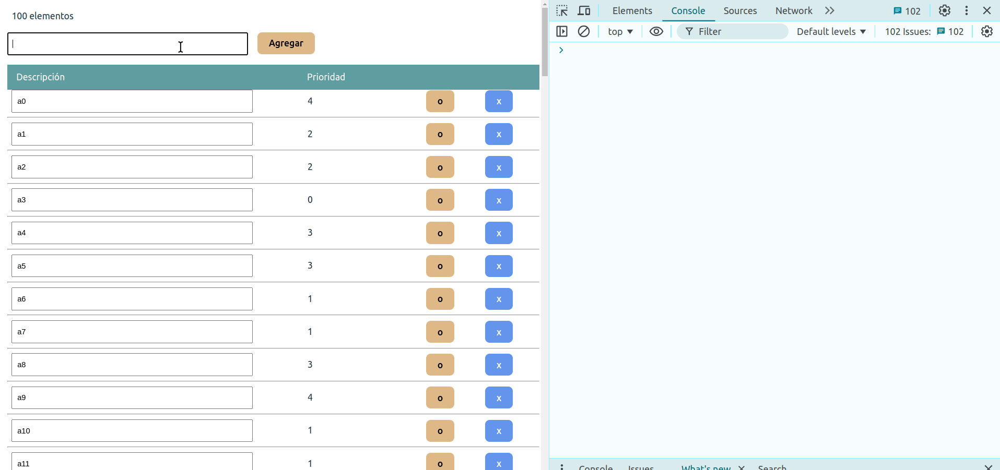

## Acotando las funciones que se pasan a los componentes hijos

Un detalle adicional es que cada vez que se dispara el render en el componente TodoList, eso construye una nueva función `deleteItem`, otra `changeDescription`, etc. Esto no constituye un problema en sí, el tiempo que tardamos en construir incluso 100 funciones es despreciable. Pero por motivos didácticos, introduzcamos el siguiente hook en el componente `TodoItemRowPayload`:

```ts
  useEffect(() => {
    console.info('Recibí una nueva función deleteItem')
    fetch('https://medium.com/@cybersphere/fetch-api-the-ultimate-guide-to-cors-and-no-cors-cbcef88d371e', {
      mode: 'no-cors' 
    }).then(() => {
      setSelected(false)
    })
  }, [deleteItem])
```

Lo que pasa es que cada vez que redibujo eso dispara 100 fetchs porque piensa que la función `deleteItem` cambió.



> Lo que vamos a hacer a continuación es solo para que tengan más idea de React, y la justificación técnica de por qué no es conveniente trabajar con los hooks `useEffect`, `useCallback` y `useMemo`

## Soluciones al problema de la creación de una función

Un detalle interesante es que si nosotros creamos un hook `useEffect` al detectar cambios en el todoItem, no se dispara para los ítems existentes (aun cuando los elimine o los cambie), solo pasa cuando agrego una nueva tarea pendiente:

```ts
useEffect(() => {
    console.info('Recibí una nueva función deleteItem')
    fetch('https://medium.com/@cybersphere/fetch-api-the-ultimate-guide-to-cors-and-no-cors-cbcef88d371e', {
      mode: 'no-cors' 
    }).then(() => {
      console.info('fetcheé! para', todoItem.description)
      setSelected(false)
    })
  }, [todoItem])
```  

Esto pasa porque cada `todoItem` forma parte del estado del componente padre, entonces sobrevive al render (tiene un scope mayor que la función que define al componente).

Ahora sí, veamos cómo podemos hacer para no volver a crear una función `deleteItem`. ¿Podemos extraerla fuera de la función render? No exactamente como tal, porque `deleteItem` necesita de los hooks para conocer el estado del todoList y para setearlo:

```ts
const deleteItem = (todoItem: TodoItem) => {
  const index = todoList.indexOf(todoItem)
  const newList = [...todoList.slice(0, index), ...todoList.slice(index + 1)]
  setTodoList(newList)
}
```

## El hook `useCallback` al rescate

El hook necesita

- una función, que va a terminar memorizándose (la guardamos en una memoria temporal o cache)
- y una lista de dependencias que regeneran la función

Si envuelvo la función tal como está...

```ts
  const deleteItem = useCallback((todoItem: TodoItem) => {
    //            todoList => sale del estado...
    const index = todoList.indexOf(todoItem)
    //
    const newList = [...todoList.slice(0, index), ...todoList.slice(index + 1)]
    setTodoList(newList)
  }, [])

  const changeDescription = useCallback((todoItem: TodoItem, newDescription: string) => {
    todoItem.description = newDescription
    const index = todoList.indexOf(todoItem)
    const newList = [...todoList.slice(0, index), todoItem, ...todoList.slice(index + 1)]
    setTodoList(newList)
  }, [])
```

... esto es una muy mala idea !!

Ahora cuando agregues un elemento y luego quieras editarlo, vas a volver al estado original de la función (el que guardamos en la cache la primera vez que construimos la función), donde solo hay 100 elementos!!

TODO: mostrar la imagen de lo que pasa

Hay que recibir el estado viejo en el hook y cambiarlo:

```ts
const changeDescription = useCallback((todoItem: TodoItem, newDescription: string) => {
    todoItem.description = newDescription
    setTodoList(prevList => {
      const index = prevList.indexOf(todoItem)
      const newList = [...prevList.slice(0, index), todoItem, ...prevList.slice(index + 1)]
      return newList
    })
  }, [])
```

de esa manera la función setTodoList funciona perfectamente porque considera el valor **dinámico** de la lista en el momento en que se ejecuta. Y tampoco se crea nuevamente copias de la función `deleteItem`.

Logramos así mantener el estado, porque deleteItem no se recrea y el hook useEffect no se dispara.

TODO: video de cómo se mantiene el estado seleccionado para varios componentes hijos aun cuando agrego elementos o hago un change, porque la función deleteItem sigue siendo la misma.

## Volviendo sobre nuestros pasos

Tomémonos un tiempo para pensar sobre todo lo que hicimos hasta ahora.
